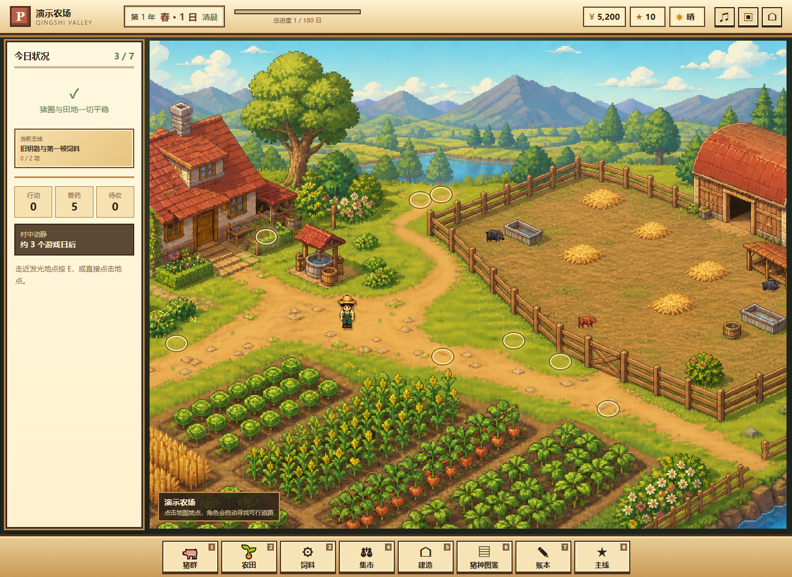
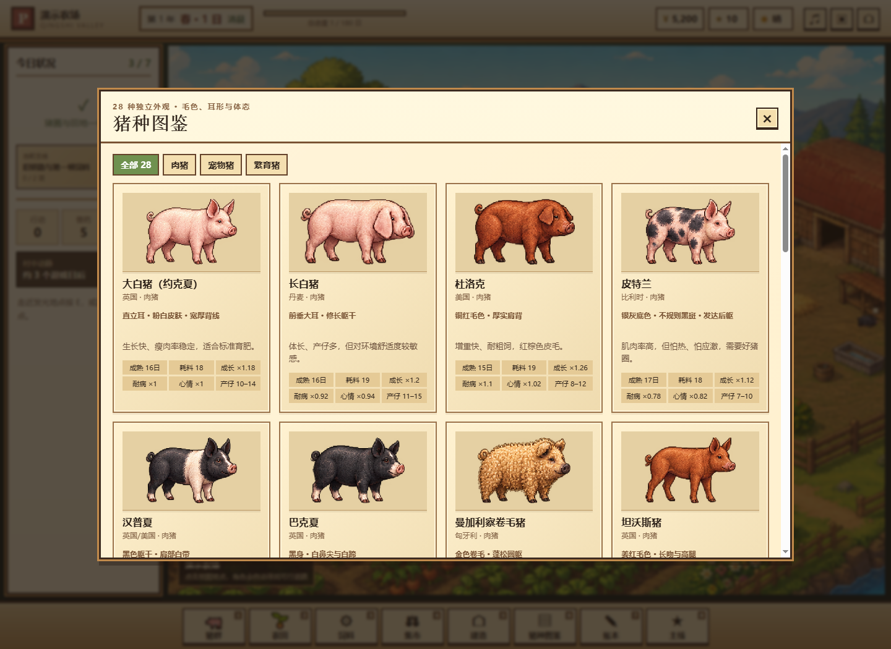
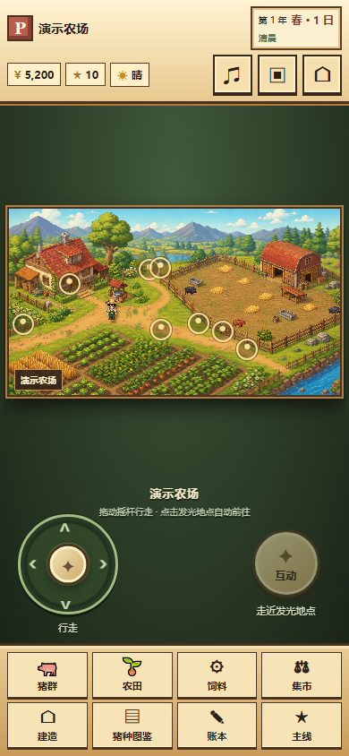

# 豚物语 · 口袋猪场

一款中文像素农场经营游戏：在三年 180 个游戏日里养猪、种田、赶集、繁育、训练与参加比赛。当前版本 **1.13.0**，同一套经营核心支持桌面键鼠与手机触控，并提供可安装、可离线游玩的 PWA。

## 游戏画面

以下为本项目 1.13.0 在浏览器中的实际运行截图，使用独立演示存档。

### 农场与自由行走



### 猪种图鉴



### 手机触控布局



## 主要玩法

- **28 个猪种、三条经营路线**：肉猪、宠物猪与繁育猪拥有不同的成长、饲料、体格与繁殖特性，配有独立外观和动作。
- **六张可行走地图**：自家农场、青石镇集市、石桥牧场、后山林场、青石村和青石赛场。
- **长期经营**：逐猪配餐、播种收获、加工饲料、设施升级、疾病处理、雇员、合同与繁育。
- **九章主线与赛事**：主线目标、季节活动、训练赛和第三年终局；经营状态决定比赛成绩。
- **本地存档**：自动保存、最多八个农场、JSON 备份导入导出；设备间需手动转移，暂无自动同步。
- **手机 PWA**：摇杆、地点自动前往、横竖屏布局、完整资源缓存与用户主动确认更新。

## 本地运行

需要 Node.js 22 或更新版本。不依赖第三方 npm 包。

```sh
npm run build
npm run dev
```

打开 <http://127.0.0.1:8767>。电脑默认使用键鼠界面；加 `?mobile=1` 可预览手机触控界面，`?mobile=0` 可强制桌面界面。桌面构建也可通过 <http://127.0.0.1:8767/desktop/index.html> 查看。

只生成离线桌面版：

```sh
npm run build:desktop
```

生成后用 Chrome / Edge 打开 `desktop-build/index.html`，或运行其中的 `启动游戏.bat`。手机安装及离线缓存需要 HTTPS 或 localhost 安全环境，不能直接用手机打开本地 HTML 文件。

## 操作与存档

电脑使用 `WASD` / 方向键移动，`E` 互动，数字键 `1`—`8` 打开管理入口，`Esc` 关闭面板；点击地图上的发光地点可自动前往。手机使用左侧摇杆、右侧互动按钮与下方八个菜单。

存档只保存在相应设备和浏览器中。清理浏览器数据前，在 **账本 → 存档管理** 导出 JSON 备份；导入会建立独立农场。PWA 更新会先完整下载资源，再在标题页等待玩家点击“保存并更新”。

## 项目结构

| 目录 | 用途 |
| --- | --- |
| `game/` | 共用游戏核心、经营规则、数据、六张场景及完整本地美术资产 |
| `mobile/` | 触控界面、手机布局、安装提示、离线缓存与更新 |
| `scripts/` | 从共用核心构建网站和桌面输出 |
| `tests/` | 经营规则、生命周期、触屏、PWA 与美术资产完整性检查 |
| `docs/images/` | README 使用的真实运行截图 |
| `desktop-baseline.json` | 旧版 1.12.0 逐文件哈希，核对核心规则的保留情况 |

`dist/` 和 `desktop-build/` 均由构建生成；请修改 `game/` 或 `mobile/`，再重新构建。

## 验证

```sh
npm run build
npm run check
npm run check:desktop
node tests/core-regression/run.cjs
node tests/lifecycle.cjs
```

经营规则回归包含种植、喂养、交易、疾病、主线、三年结局、场景连通、比赛平衡与随机农场模拟。浏览器脚本还覆盖触控布局、离线重开和更新；可参考 [浏览器验证说明](docs/verification.md) 与 [原版验收报告](验收报告.md)。

手机验证使用 Chrome 设备模拟，**尚未连接真实 iPhone 验证 Safari 的安装、安全区、软键盘和系统分享**。

## 美术与声音

像素场景、人物立绘、行走图集与猪只美术由 OpenAI 图像生成工具制作，再接入本地游戏。音乐和操作声音由浏览器实时合成。素材细节见 [美术素材说明](game/美术素材说明.md)。

此仓库未另行授予开源许可证；如需对外再分发或商用，请先确认代码及素材的使用授权。
